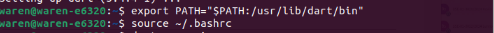
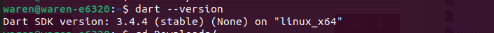
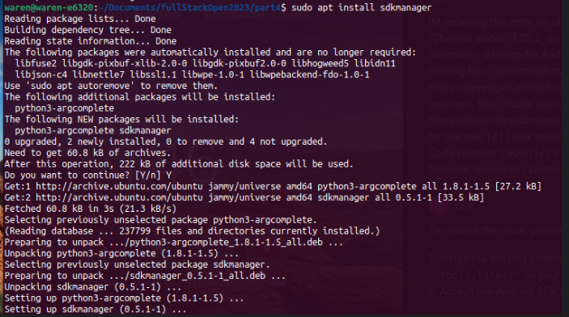
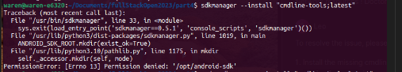
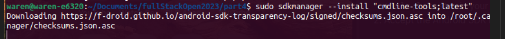

# Installing dart

To begin with visit the dart website, based on your **os** ->`operating system` follow the steps to install it.


luckily for linux users more so ubuntu I have you covered.


    If you run into problems during the installation process, you have to configure your debian package manager first before proceeding

-   Then run the install command below

    ``` bash
    sudo apt-get install dart
    ```
rember to provide the admin password otherwise the installation will terminate

here is a close look at the process


next you need to add dart to the PATH so that you can execute it globally

 ```bash
 export PATH="$PATH:/usr/lib/dart/bin"
 ```

 followed by

 ```bash
 source ~/.bashrc
 ```

here is a glimpse



 Test if the installation was succesful using 

 ```bash
dart --version
 ```

you shoud be able to see something like this




I assume you have Flutter installed  if not just follow the simple steps on their website .

Let's check if we have everything set to start our android development.

run the commmand

```bash
flutter doctor -v
```
see the figure below


Ooops!! we have a probblem it seems we don't have `android toolchain installed` let's fix this issue right away

first install the `sdk manager`



then lets install the *`cmdline-tools;latest`*

```bash 
sdkmanager --install "cmdline-tools;latest"
```


Woopsy.. it seems we forgot to run the command with super user permission.

no worries just run this line

```bash 
sudo sdkmanager --install "cmdline-tools;latest"
```


well done ..

Now for the *android licenses* just run

```bash 
flutter doctor --android-licenses
```
and accept the license agreement.

### **you are now read to start your development journey using dart,flutter and android**