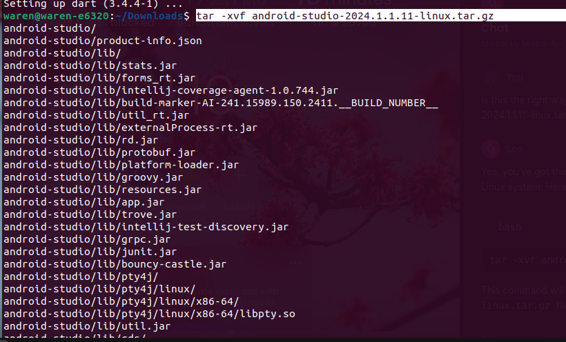

# installation procedure


**`nb : for linux user's`**

now for this installation head over to the android studio website and download the zip file for linux distribution.

once downloaded :

- open the terminal and make sure you are in the directory/ folder where you had downloaded the file.

- run the command below

<code>
    tar -xvf android-studio-&lt; version &gt;-linux.tar.gz 
</code>

*make sure to replace the &lt; version &gt;* with the recommended vesion on the official site.

the installation will run as shown below.




Now try running the android script from the bin

*remember to run the commands on the terminal*

``` bash
# for us case it is in the downloads folder

cd Downloads/android-studio/bin/

```
followed by

``` bash
./studio.sh
```


## The might welcome screen


Now before we continue install dart and flutter.

let's install dart for our case as it is the most challenging 

[here is how](./Dart.md)
